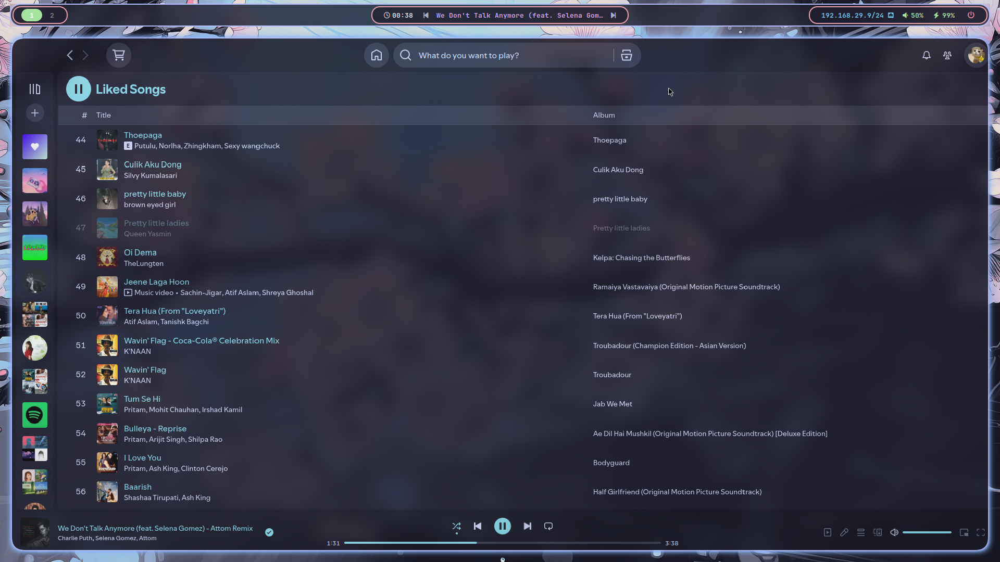
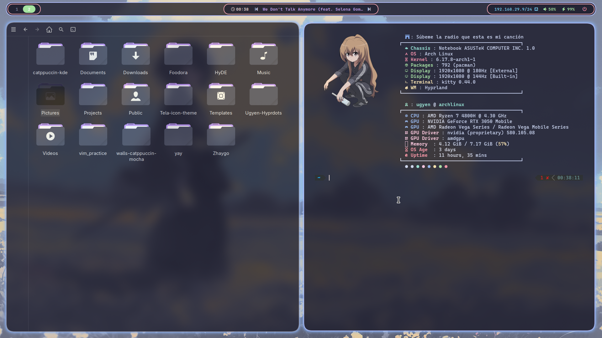
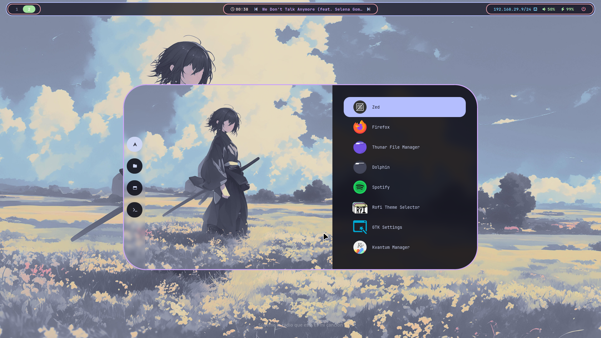
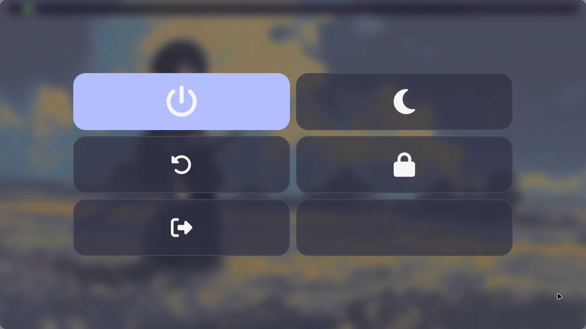
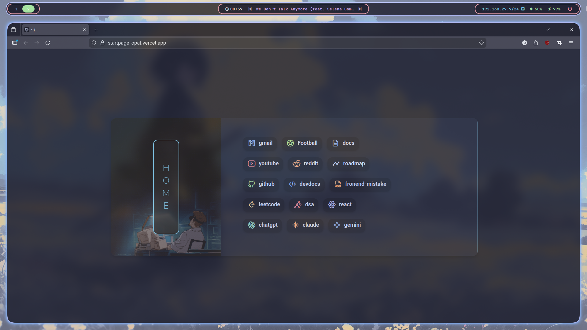

# 🌸 Ugyen-Hyprdots ～ ✧･ﾟ: _✧･ﾟ:_

A pastel-themed collection of my **Hyprland dotfiles** — made with love, curiosity,  
and a beginner’s determination to make Linux look _kawaii & comfy_. (๑˃ᴗ˂)ﻭ♡

This repo is my little learning garden 🌱 where I grow my ricing skills,  
customize things slowly, and try not to bork my system too much (lol).

---

## ✨ What’s Inside? (WIP 🍡)

- 🌸 Hyprland configs with soft aesthetic vibes
- 🩵 Waybar tweaks & pastel themes
- 🎀 Scripts for tiny QoL magic
- 🌼 Wallpapers and cozy color palettes
- 📘 Cute and beginner-friendly structure
- 💫 More experiments as I level up!

---

## 📂 Repository Structure

The following is the layout of the configurations within this repository:

```text
Ugyen-Hyprdots/
├── .config/       # Hyprland and core application configurations
├── .local/        # Rofi Theme and local scripts
├── .p10k.zsh/     # Powerlevel10k Zsh theme configuration
├── .zshrc         # Primary Zsh shell configuration file
└── README.md      # This file

```

---

## 🌈 My Ricing Philosophy ~

> “Your desktop should make you smile every time you see it.”  
> — me (and probably some anime character somewhere)

I’m learning by tweaking little by little —  
every improvement = +1 XP to my ricing skill tree. 🎮✨

---

## 🖼️ Rice Showcase 🌸✨

| 🌸 Rice 1                            | 🍡 Rice 2                            |
| ------------------------------------ | ------------------------------------ |
|  |  |

| 🎀 Rice 3                            | 💕 Rice 4                            |
| ------------------------------------ | ------------------------------------ |
|  |  |

### 🌟 Extra Shot

<p align="center">
  
</p>

---

## 💻 How to Try It (Careful pls~)

```bash
git clone https://github.com/ugyenx/Ugyen-Hyprdots
cd Ugyen-Hyprdots


You may need to adjust paths since I’m still a newbie~
But sharing is caring, so feel free to peek & use anything you like! ✨
```
